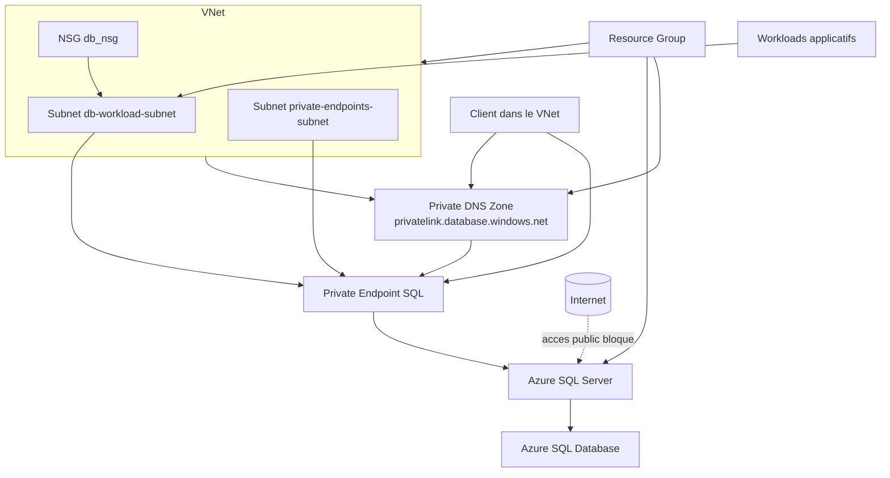

# Exercice Security - Azure SQL (MsSQL) securise avec Terraform

Ce dossier présente une logique modulaire Terraform, avec l'objectif de provisionner une base Azure SQL de façon securisee et pedagogique.

## Objectif pedagogique

A la fin de cet exercice, vous devez comprendre:
- comment decouper une infra Terraform en modules reutilisables;
- comment exposer une base de donnees uniquement en prive (pas d'acces Internet public);
- comment activer des controles securite essentiels pour SQL Server;
- comment transmettre les sorties utiles sans exposer les secrets.

## A quoi servent les outputs Terraform

Dans Terraform, les blocs `output` (souvent places dans `outputs.tf`) servent a exposer des valeurs utiles apres `terraform apply`.
Ils ne creent pas de ressources: ils publient des resultats de l'infrastructure.

Usages principaux:
1. Afficher des informations utiles en fin de deploiement (ID, IP, noms, FQDN).
2. Partager des valeurs entre modules Terraform.
3. Alimenter des scripts/outils via `terraform output` (CI/CD, automatisation).
4. Definir le contrat d'interface d'un module (ce qu'il fournit au module parent).

Dans cet exercice, les outputs servent bien a partager des valeurs entre modules:
- Le module `network` expose `vnet_id` et `private_endpoint_subnet_id`.
- Le module racine lit `module.mon_reseau.vnet_id` et `module.mon_reseau.private_endpoint_subnet_id`.
- Ces valeurs sont passees en entree du module `mssql` via `vnet_id` et `target_subnet_id`.

Note: `db_subnet_id` est expose par le module `network`, mais n'est pas encore consomme par un autre module dans cette version.

## Arborescence

Voir aussi [structure.txt](structure.txt).

- [main.tf](main.tf): orchestration racine
- [variables.tf](variables.tf): variables globales
- [terraform.tfvars](terraform.tfvars): valeurs d'environnement
- [outputs.tf](outputs.tf): sorties finales
- [modules/network/main.tf](modules/network/main.tf): VNet, subnets, NSG
- [modules/mssql/main.tf](modules/mssql/main.tf): SQL, DB, Private Endpoint, Private DNS

## Architecture cible

1. Un VNet dedie.
2. Un subnet applicatif (workloads).
3. Un subnet dedie aux private endpoints.
4. Un Azure SQL logical server.
5. Une base de donnees SQL.
6. Un Private Endpoint vers le SQL server.
7. Une zone DNS privee liee au VNet pour la resolution du FQDN SQL.

## Schema de l'environnement



Lecture rapide du schema:
1. Le trafic applicatif reste dans le VNet.
2. Le SQL Server n'est pas expose publiquement (`public_network_access_enabled = false`).
3. La resolution DNS privee redirige le FQDN SQL vers l'IP privee du Private Endpoint.
4. Le NSG est associe au subnet des workloads pour rendre les intentions de filtrage explicites.

## Best practices securite appliquees

1. Pas d'exposition publique de la base
- Dans [modules/mssql/main.tf](modules/mssql/main.tf), `public_network_access_enabled = false`.
- Effet: impossible de se connecter a la base depuis Internet.

2. Acces prive uniquement
- Private Endpoint configure dans [modules/mssql/main.tf](modules/mssql/main.tf).
- Zone DNS privee `privatelink.database.windows.net` + lien VNet.
- Effet: les clients dans le VNet resolvent le serveur SQL vers une IP privee.

3. Chiffrement en transit
- `minimum_tls_version = "1.2"` dans [modules/mssql/main.tf](modules/mssql/main.tf).
- Effet: bloque les clients trop anciens/non securises.

4. Chiffrement au repos
- `transparent_data_encryption_enabled = true` sur la base dans [modules/mssql/main.tf](modules/mssql/main.tf).
- Effet: les donnees stockees sont chiffrees automatiquement.

5. Authentification centralisee Entra ID
- Bloc `azuread_administrator` avec `azuread_authentication_only = true` dans [modules/mssql/main.tf](modules/mssql/main.tf).
- Effet: reduction de la dependance aux comptes SQL locaux.

6. Secret admin fort
- Si `sql_admin_password` est null, Terraform genere un mot de passe fort via `random_password`.
- Le mot de passe reste sensible dans les outputs.
- Effet: evite les mots de passe faibles en dur dans les fichiers.

### Focus sur la ligne 8 de modules/mssql/main.tf

La ligne suivante definit le mot de passe admin SQL effectivement utilise:

`effective_sql_admin_password = coalesce(var.sql_admin_password, random_password.generated_sql_admin_password.result)`

Explication:
1. `coalesce(...)` retourne la premiere valeur non nulle.
2. Si `var.sql_admin_password` est renseigne, Terraform utilise cette valeur.
3. Sinon, Terraform utilise le mot de passe genere par `random_password.generated_sql_admin_password.result`.

Cette logique permet de couvrir les deux cas: mot de passe fourni manuellement ou generation automatique securisee.

7. Segmentation reseau
- Subnet dedie pour Private Endpoint dans [modules/network/main.tf](modules/network/main.tf).
- NSG explicite pour pedagogie (deny inbound Internet visible).
- Effet: architecture plus lisible et mieux cloisonnee.

## Comment reutiliser ce code

1. Renseigner votre contexte
- Mettre le bon `rg_name` dans [terraform.tfvars](terraform.tfvars).
- Mettre un `sql_server_name` unique globalement.
- Remplacer `aad_admin_object_id` et `aad_admin_login_username`.

2. Initialiser
```bash
terraform init
```

3. Verifier
```bash
terraform fmt -recursive
terraform validate
terraform plan
```

4. Deployer
```bash
terraform apply
```

## Prochaines etapes detaillees (guide pas-a-pas)

1. Verifier les pre-requis locaux
- Terraform installe (`terraform -version`).
- Azure CLI installe (`az version`).
- Session Azure ouverte (`az login`).

### Connexion Azure CLI en mode interactif (obligatoire avant Terraform)

Si vous n'etes pas encore connecte a Azure, utilisez la connexion interactive:

```bash
az login
```

Selon votre poste, Azure CLI ouvre votre navigateur pour vous authentifier.
Une fois connecte, verifiez le compte actif:

```bash
az account show --output table
```

Si vous avez plusieurs abonnements, choisissez celui du lab:

```bash
az account list --output table
az account set --subscription "<SUBSCRIPTION_ID_OU_NOM>"
az account show --output table
```

Quand cette etape est validee, Terraform utilisera automatiquement cette session Azure CLI.

2. Cibler le bon abonnement Azure
```bash
az account list --output table
az account set --subscription "<SUBSCRIPTION_ID_OU_NOM>"
```

3. Completer les variables obligatoires dans [terraform.tfvars](terraform.tfvars)
- `rg_name`: Resource Group existant.
- `sql_server_name`: nom unique global Azure.
- `aad_admin_object_id`: Object ID Entra ID (groupe recommande).
- `aad_admin_login_username`: nom du groupe/user Entra ID admin SQL.

4. Initialiser et valider la configuration
```bash
terraform init
terraform fmt -recursive
terraform validate
```

5. Lire le plan avant deployment
```bash
terraform plan -out tfplan
```
Controlez surtout:
- la creation du Private Endpoint;
- `public_network_access_enabled = false`;
- la presence de l'admin Entra ID;
- les ressources DNS privees.

6. Deployer l'infrastructure
```bash
terraform apply tfplan
```

7. Verifier les sorties utiles
```bash
terraform output
```
Elements attendus:
- `sql_server_fqdn`
- `sql_database_name`
- `private_endpoint_ip`

8. Tester la connectivite privee (depuis une VM dans le VNet)
- Resolution DNS du FQDN SQL vers une IP privee.
- Connexion SQL uniquement depuis le reseau autorise.

9. Nettoyer l'environnement de lab (quand termine)
```bash
terraform destroy
```

10. Aller plus loin
- Ajouter l'auditing SQL.
- Activer Defender for SQL.
- Integrer Key Vault pour la gestion des secrets.

## Points de vigilance

1. Le nom du SQL server doit etre unique a l'echelle Azure.
2. Si votre poste n'est pas relie au VNet, vous ne pourrez pas vous connecter a la base (normal, car acces prive).
3. Les valeurs sensibles ne doivent pas etre committees dans Git.

## Pistes d'amelioration (niveau avance)

1. Ajouter Microsoft Defender for SQL.
2. Ajouter Auditing SQL vers Log Analytics/Storage.
3. Remplacer la gestion locale des secrets par Azure Key Vault + pipeline CI/CD.
4. Ajouter des policies Azure pour imposer TLS, private endpoints et tags.

## Mapping rapide Ex2 -> Security

- Module `compute` (Ex2) devient module `mssql`.
- Module `network` reste present, mais adapte au pattern private endpoint.
- Les outputs finaux affichent des infos SQL (FQDN prive, IP privee) plutot qu'une IP publique de VM.
