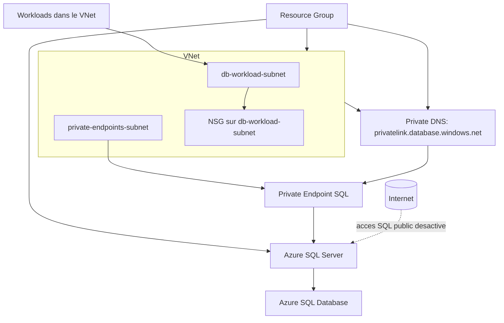

# Exercice Security Ex1 - Azure SQL prive avec Terraform

Ce dossier Ex1 deploie une architecture SQL securisee et modulaire sur Azure:
- Azure SQL expose uniquement en prive (pas d'acces public Internet).
- Segmentation reseau avec subnet workloads + subnet private endpoints.
- Authentification Entra ID sur SQL.
- DNS prive pour la resolution interne du FQDN SQL.

## Objectif pedagogique

A la fin de cet exercice, vous devez comprendre:
- la decomposition Terraform en modules reutilisables;
- le pattern Private Endpoint + DNS prive pour SQL;
- les controles de securite de base a appliquer sur Azure SQL;
- l'utilisation des outputs Terraform pour exposer des informations utiles.

## Modules Ex1

- `modules/network`
  - VNet et 2 subnets:
    - `db-workload-subnet`
    - `private-endpoints-subnet`
  - NSG associe au subnet workloads.

- `modules/mssql`
  - Azure SQL Server + base SQL.
  - `public_network_access_enabled = false`.
  - `minimum_tls_version = "1.2"`.
  - TDE active sur la base.
  - Admin Entra ID avec `azuread_authentication_only = true`.
  - Private Endpoint SQL + zone DNS `privatelink.database.windows.net`.

## Architecture cible



## Ressources principales creees

- VNet + subnets workloads/private endpoints.
- NSG pedagogique avec regle explicite de deny inbound Internet.
- Azure SQL logical server.
- Azure SQL database.
- Private Endpoint vers SQL Server.
- Private DNS zone + lien VNet.

## Sorties Terraform importantes

Apres `terraform apply`, utilisez `terraform output` pour recuperer:
- `sql_server_fqdn`
- `sql_server_name`
- `sql_database_name`
- `private_endpoint_ip`
- `generated_sql_admin_password` (sensible, uniquement si `sql_admin_password = null`)

## Bonnes pratiques securite appliquees

1. SQL non expose publiquement
- `public_network_access_enabled = false` sur SQL Server.
- Impact: aucune connexion directe depuis Internet.

2. Connectivite privee uniquement
- Private Endpoint SQL dans le subnet dedie.
- DNS prive `privatelink.database.windows.net` relie au VNet.
- Impact: resolution du FQDN SQL vers IP privee.

3. Chiffrement en transit
- `minimum_tls_version = "1.2"`.
- Impact: refus des clients TLS obsoletes.

4. Chiffrement au repos
- `transparent_data_encryption_enabled = true` sur la base.
- Impact: donnees chiffrees au repos.

5. Authentification Entra ID
- Bloc `azuread_administrator` avec `azuread_authentication_only = true`.
- Impact: reduction de l'usage des comptes SQL locaux.

6. Gestion du mot de passe SQL admin
- Si `sql_admin_password` est null, Terraform genere un mot de passe fort (`random_password`).
- Le mot de passe genere reste sensible dans les outputs.

## Deploiement pas-a-pas

1. Se connecter a Azure:
```bash
az login
az account show --output table
```

2. Selectionner l'abonnement:
```bash
az account list --output table
az account set --subscription "<SUBSCRIPTION_ID_OU_NOM>"
```

3. Renseigner `terraform.tfvars`:
- `rg_name`: Resource Group existant.
- `sql_server_name`: nom unique globalement.
- `aad_admin_object_id`: object ID Entra ID.
- `aad_admin_login_username`: nom/login de l'admin Entra.
- `vnet_params`: CIDR VNet et subnets.

4. Initialiser et valider:
```bash
terraform init
terraform fmt -recursive
terraform validate
```

5. Planifier:
```bash
terraform plan -out tfplan
```

6. Appliquer:
```bash
terraform apply tfplan
```

7. Verifier les outputs:
```bash
terraform output
```

8. Nettoyer le lab si besoin:
```bash
terraform destroy
```

## Verifications post-deploiement

- SQL Server: acces public desactive.
- FQDN SQL: resolution privee depuis un reseau connecte au VNet.
- Private Endpoint SQL: provisionne et associe au DNS prive.
- NSG: present sur subnet workloads.

## Points de vigilance

- Le nom du SQL Server doit etre unique globalement.
- Sans acces reseau au VNet, la connexion a SQL est attendue comme indisponible.
- Ne pas versionner de secrets ni d'outputs sensibles dans Git.

## Pistes d'amelioration

- Ajouter Microsoft Defender for SQL.
- Ajouter auditing SQL vers Log Analytics/Storage.
- Integrer Azure Key Vault pour la gestion des secrets.
- Evoluer vers Ex2 pour ajouter VM d'administration, Bastion et observabilite privee.
