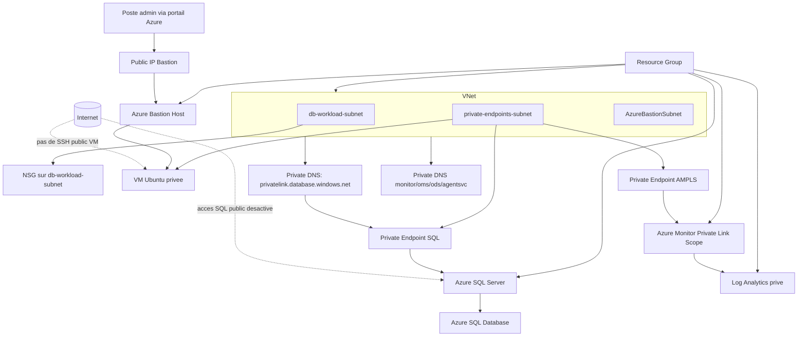

# Exercice Security Ex2 - Azure SQL prive, VM d'administration, observabilite privee et Azure Bastion

Ce dossier Ex2 deploie une architecture securisee sur Azure avec Terraform:
- Azure SQL accessible uniquement en prive (Private Endpoint + DNS prive).
- VM Ubuntu interne pour administration/tests SQL.
- Identite managee de la VM utilisee comme administrateur Entra ID de SQL.
- Log Analytics prive via AMPLS + diagnostics centralises.
- Azure Bastion pour acceder a la VM sans exposer de port SSH public.

## Objectif pedagogique

A la fin de cet exercice, vous devez comprendre:
- la modularisation Terraform (network, vm, mssql, observability);
- le pattern Private Endpoint + DNS prive pour SQL;
- l'authentification Entra ID pour SQL via managed identity;
- le monitoring prive avec Log Analytics et AMPLS;
- l'administration d'une VM privee via Azure Bastion.

## Modules Ex2

- `modules/network`
  - VNet et 3 subnets:
    - `db-workload-subnet`
    - `private-endpoints-subnet`
    - `AzureBastionSubnet`
  - NSG pedagogique sur `db-workload-subnet`.
  - Azure Bastion Host + Public IP Standard.

- `modules/vm`
  - VM Linux Ubuntu.
  - NIC privee uniquement (pas d'IP publique).
  - Identite managee SystemAssigned.
  - Mot de passe admin local genere automatiquement.
  - Bootstrap cloud-init: Azure CLI + pilotes/outils SQL (`msodbcsql18`, `mssql-tools18`).

- `modules/mssql`
  - Azure SQL Server + base SQL.
  - `public_network_access_enabled = false`.
  - `minimum_tls_version = "1.2"`.
  - TDE active sur la base.
  - Admin Entra ID active en mode `azuread_authentication_only = true`.
  - Private Endpoint SQL + zone DNS `privatelink.database.windows.net`.

- `modules/observability`
  - Log Analytics Workspace prive (`internet_ingestion_enabled = false`, `internet_query_enabled = false`).
  - Azure Monitor Private Link Scope (AMPLS).
  - Private Endpoint AMPLS + zones DNS privees monitor/oms/ods/agentsvc.
  - Diagnostic settings sur SQL Server, SQL DB, VM, NSG.

## Architecture cible



## Sequence d'identite admin SQL

1. La VM est creee avec une identite managee system-assigned.
2. Le `principal_id` de cette identite est expose par le module VM.
3. Le module SQL reutilise ce `principal_id` dans `azuread_administrator`.
4. La VM peut ensuite s'authentifier a SQL via Entra ID selon les droits associes.

## Sorties Terraform importantes

Apres `terraform apply`, utilisez `terraform output` pour recuperer:
- `sql_server_fqdn`
- `sql_server_name`
- `sql_database_name`
- `private_endpoint_ip`
- `vm_private_ip`
- `vm_identity_principal_id`
- `log_analytics_workspace_id`
- `log_analytics_workspace_name`
- `generated_sql_admin_password` (sensible, renseigne si `sql_admin_password = null`)
- `vm_admin_password` (sensible, mot de passe local de la VM)
- `bastion_public_ip`
- `bastion_host_id`

## Utilisation d'Azure Bastion (important)

Le design Ex2 impose une VM sans IP publique. L'acces d'administration se fait via Azure Bastion.

Prerequis:
- Avoir deploye Ex2 avec succes.
- Recuperer le login local VM (`vm_admin_username` dans `terraform.tfvars`, par defaut `azureuser`).
- Recuperer le mot de passe VM:

```bash
terraform output -raw vm_admin_password
```

Connexion via portail Azure:
1. Ouvrir la ressource VM creee par Ex2.
2. Cliquer sur Connect puis Bastion.
3. Methode d'authentification: mot de passe.
4. Username: valeur de `vm_admin_username`.
5. Password: valeur de `terraform output -raw vm_admin_password`.
6. Ouvrir la session et executer les tests reseau/SQL depuis la VM.

Ce que Bastion apporte dans ce lab:
- aucun port SSH public sur la VM;
- acces admin centralise via un service manage Azure;
- surface d'attaque reduite par rapport a une VM exposee en Internet.

## Deploiement pas-a-pas

1. Se connecter a Azure:
```bash
az login
az account show --output table
```

2. Selectionner l'abonnement:
```bash
az account list --output table
az account set --subscription "<SUBSCRIPTION_ID_OU_NOM>"
```

3. Verifier et adapter `terraform.tfvars`:
- `rg_name`: Resource Group existant.
- `sql_server_name`: unique globalement dans Azure.
- `vm_name`, `vm_size`, `vm_admin_username`.
- `vnet_params` (incluant `bastion_subnet_cidr`).

4. Initialiser et valider:
```bash
terraform init
terraform fmt -recursive
terraform validate
```

5. Planifier:
```bash
terraform plan -out tfplan
```

6. Appliquer:
```bash
terraform apply tfplan
```

7. Verifier les outputs:
```bash
terraform output
```

8. Ouvrir une session sur la VM via Bastion (et non SSH public).

9. Nettoyer le lab si besoin:
```bash
terraform destroy
```

## Verifications de securite a faire apres deploiement

- SQL public desactive:
  - verifier `public_network_access_enabled = false` sur SQL Server.
- Resolution DNS privee SQL:
  - le FQDN SQL doit resoudre vers une IP privee du Private Endpoint depuis le VNet.
- VM non exposee publiquement:
  - aucune IP publique attachee a la NIC VM.
- Bastion present et fonctionnel:
  - la connexion VM se fait via Bastion depuis le portail Azure.
- Observabilite privee:
  - le workspace Log Analytics n'accepte pas ingestion/query Internet.

## Notes importantes

- Le nom SQL Server doit etre unique globalement.
- Les outputs sensibles ne doivent pas etre commits dans Git.
- Les Private Endpoints ne supportent pas les diagnostics Azure Monitor: c'est normal de ne pas avoir de diagnostic setting sur le PE SQL.

## Pistes d'amelioration

- Ajouter Microsoft Defender for SQL.
- Ajouter auditing SQL vers Storage/Log Analytics selon vos objectifs.
- Integrer Azure Key Vault pour la gestion des secrets.
- Renforcer les controles NSG/UDR selon le contexte de production.
