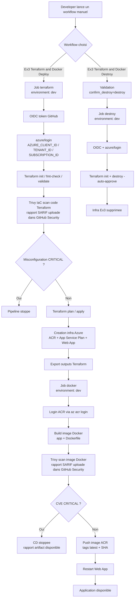

# Ex3 - Terraform modulaire + ACR + Web App conteneurisee

## Objectif
Ce dossier deploie, avec Terraform modulaire:
- un Azure Container Registry (ACR)
- une Azure Linux Web App qui consomme une image Docker stockee dans ACR

Une pipeline GitHub Actions est fournie pour:
- deployer/configurer les ressources Azure via Terraform
- builder l'image Docker depuis `app/app.js` avec le `docker/Dockerfile`
- scanner l'image Docker avec Trivy (rapport + gate securite)
- pousser l'image dans ACR
- redemarrer la Web App pour prendre la derniere image
- detruire l'infrastructure Terraform pour nettoyer le lab

## Structure
- `main.tf`, `variables.tf`, `outputs.tf`, `terraform.tfvars`
- `modules/acr` : module ACR
- `modules/webapp` : module App Service Plan + Linux Web App
- `.github/workflows/ex3-terraform-acr-webapp.yml` : pipeline de deploiement (manuel)
- `.github/workflows/ex3-terraform-acr-webapp-destroy.yml` : pipeline de destruction (manuel)

## Workflows GitHub Actions
- `Ex3 Terraform and Docker Deploy`
  - declenchement manuel (`workflow_dispatch`)
  - scan Trivy IaC du code Terraform avec rapport SARIF
  - blocage si misconfiguration `CRITICAL` dans le code Terraform
  - provisionnement Terraform + build Docker
  - scan Trivy de l'image Docker avec rapport SARIF
  - blocage de la CD si CVE `CRITICAL` detectee dans l'image
  - push ACR + restart Web App si les deux gates de securite sont valides
- `Ex3 Terraform and Docker Destroy`
  - declenchement manuel (`workflow_dispatch`)
  - destruction Terraform avec confirmation obligatoire via l'input `confirm_destroy=destroy`

## Environnement GitHub `dev`
Nous utilisons un environnement GitHub nomme `dev` pour securiser les jobs de deploiement et de destruction.

Dans les workflows, chaque job principal declare:
- `environment: dev`

Cela permet:
- d'appliquer des regles d'environnement (approbation manuelle, restrictions de branche, etc.)
- d'emettre un token OIDC GitHub avec un `subject` lie a l'environnement
- d'aligner l'authentification Azure avec le Federated Credential configure sur la managed identity

## Comment l'environnement est utilise dans les workflows
Dans:
- `.github/workflows/ex3-terraform-acr-webapp.yml`
- `.github/workflows/ex3-terraform-acr-webapp-destroy.yml`

Les jobs utilisent `environment: dev`, puis s'authentifient avec:
- `azure/login@v2`
- `client-id: ${{ secrets.AZURE_CLIENT_ID }}`
- `tenant-id: ${{ secrets.AZURE_TENANT_ID }}`
- `subscription-id: ${{ secrets.AZURE_SUBSCRIPTION_ID }}`

Pour Terraform, les variables ARM OIDC sont aussi positionnees dans les jobs:
- `ARM_USE_OIDC=true`
- `ARM_CLIENT_ID`
- `ARM_TENANT_ID`
- `ARM_SUBSCRIPTION_ID`

## Prerequis OIDC (managed identity)
La pipeline utilise `azure/login` en OIDC avec:
- `AZURE_CLIENT_ID` = Client ID de l'identite user-assigned `mi-ynov-labo-epe`
- `AZURE_TENANT_ID` = Tenant ID
- `AZURE_SUBSCRIPTION_ID` = Subscription ID

Le workflow est configure avec l'environnement GitHub `dev`.
Le `Subject identifier` du Federated Credential doit donc etre:
- `repo:texofr/YnovCloudSecurityModule2026:environment:dev`

A configurer cote Azure avant execution:
1. Creer un Federated Credential sur l'identite `mi-ynov-labo-epe` pour le repo GitHub.
2. Donner a cette identite les roles suffisants sur le scope cible (au minimum Contributor, et User Access Administrator si creation de role assignments).
3. Creer l'environnement GitHub `dev` dans le repository (Settings > Environments).

## Configuration des secrets GitHub
Dans le repository GitHub, ajouter ces secrets (Settings > Secrets and variables > Actions):
- `AZURE_CLIENT_ID`
- `AZURE_TENANT_ID`
- `AZURE_SUBSCRIPTION_ID`

Valeurs attendues:
- `AZURE_CLIENT_ID`: Client ID de la managed identity `mi-ynov-labo-epe`
- `AZURE_TENANT_ID`: ID du tenant Microsoft Entra
- `AZURE_SUBSCRIPTION_ID`: ID de la souscription Azure cible

## Configuration de la managed identity (OIDC)
Sur l'identite user-assigned `mi-ynov-labo-epe`:
- ajouter un Federated Credential avec:
	- Issuer: `https://token.actions.githubusercontent.com`
	- Audience: `api://AzureADTokenExchange`
	- Subject identifier: `repo:texofr/YnovCloudSecurityModule2026:environment:dev`
- attribuer les roles RBAC necessaires sur le scope cible:
	- `Contributor` (creation/mise a jour/suppression des ressources)
	- `User Access Administrator` (si Terraform cree des role assignments)

Sans cette configuration, `azure/login` et les commandes Terraform/Azure CLI ne pourront pas s'authentifier en OIDC.

## Schema CI/CD de l'exercice
Le deploiement et le nettoyage sont executes uniquement via GitHub Actions (manuels).

## Scans Trivy et gates de securite
Deux scans Trivy distincts sont executes dans le workflow de deploiement:

### 1. Scan IaC (code Terraform)
- se declenche apres `terraform validate`, avant `terraform plan`
- scan de type `config` sur `Exercices/Terraform/Ex3`
- detecte les mauvaises configurations de securite (ex: ressources non chiffrees, acces publics, etc.)
- gate bloquant si misconfiguration de severite `CRITICAL`

### 2. Scan image Docker
- se declenche apres le build de l'image, avant le push ACR
- detecte les CVE dans les paquets OS et librairies de l'image
- gate bloquant si CVE de severite `CRITICAL` avec correctif disponible

Dans les deux cas:
- un rapport SARIF est publie dans l'onglet **Security > Code scanning** du repository GitHub
- un rapport est archive comme artifact du run GitHub Actions (retention 30 jours)

Artifacts produits:
- `trivy-iac-sarif-report`
- `trivy-iac-critical-gate`
- `trivy-sarif-report`
- `trivy-critical-gate`
