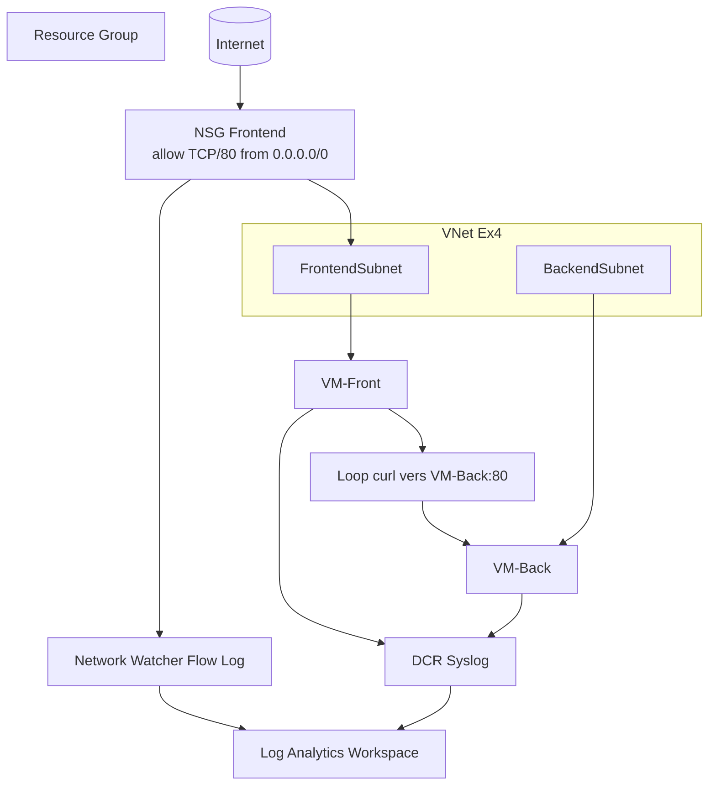

# Exercice Security Ex4 - Mouvement lateral, faille NSG et observabilite

Ce dossier Ex4 deploie une architecture volontairement vulnerable sur Azure avec Terraform:
- une zone Frontend exposee en HTTP depuis Internet (faille initiale);
- une zone Backend sans cloisonnement restrictif;
- deux VMs Linux qui simulent un trafic Est-Ouest anormal;
- une pile d'observabilite pour analyser les flux et journaux via KQL.

Le deploiement et la destruction sont disponibles via GitHub Actions:
- `.github/workflows/ex4-terraform-deploy.yml`
- `.github/workflows/ex4-terraform-destroy.yml`

## Objectif pedagogique

A la fin de cet exercice, vous devez comprendre:
- comment une regle NSG trop permissive cree une surface d'attaque exploitable;
- comment observer un mouvement lateral a partir des flow logs et des logs OS;
- comment corriger l'architecture en ajoutant un NSG Backend strict;
- comment valider la correction avec Terraform + KQL.

## Modules Ex4

- `modules/network`
  - VNet avec deux subnets:
    - `FrontendSubnet`
    - `BackendSubnet`
  - NSG Frontend associe au subnet Frontend.
  - Regle volontairement faible: HTTP/80 ouvert depuis `0.0.0.0/0`.
  - Aucun NSG Backend fourni volontairement (travail etudiant).

- `modules/compute`
  - Deux VMs Linux:
    - `VM-Front` dans `FrontendSubnet`
    - `VM-Back` dans `BackendSubnet`
  - `custom_data` sur `VM-Back` pour exposer un service HTTP local sur le port 80.
  - `custom_data` sur `VM-Front` pour lancer une boucle infinie de requetes vers l'IP privee de `VM-Back`.

- `modules/observability`
  - Log Analytics Workspace.
  - Storage Account pour la retention des NSG Flow Logs.
  - `azurerm_network_watcher_flow_log` active sur le NSG Frontend avec Traffic Analytics.
  - Azure Monitor Agent (AMA) installe sur les 2 VMs.
  - Data Collection Rule (DCR) Syslog + associations sur les 2 VMs.

## Workflows GitHub Actions

- `Ex4 Terraform Deploy`
  - declenchement manuel (`workflow_dispatch`)
  - Terraform: `fmt -check`, `init`, `validate`, `plan`, puis `apply` (option `deploy=true`)
  - affiche des outputs utiles en fin de run (`vm_front_private_ip`, `vm_back_private_ip`, `flow_log_name`)

- `Ex4 Terraform Destroy`
  - declenchement manuel (`workflow_dispatch`)
  - destruction Terraform avec confirmation obligatoire via `confirm_destroy=destroy`

## Environnement GitHub `dev`

Les jobs de deploiement et de destruction utilisent:
- `environment: dev`

Cela permet:
- d'appliquer des regles d'environnement (approbation, restrictions de branche);
- d'emettre un token OIDC GitHub lie a l'environnement;
- d'aligner l'authentification Azure avec le Federated Credential.

## Prerequis OIDC et secrets GitHub

Secrets requis dans GitHub (Settings > Secrets and variables > Actions):
- `AZURE_CLIENT_ID`
- `AZURE_TENANT_ID`
- `AZURE_SUBSCRIPTION_ID`

Federated Credential cote Azure (managed identity ou app registration):
- Issuer: `https://token.actions.githubusercontent.com`
- Audience: `api://AzureADTokenExchange`
- Subject identifier: `repo:<owner>/<repo>:environment:dev`

## Architecture cible



## Faille initiale et scenario d'attaque

1. Le NSG Frontend autorise explicitement le port 80 depuis n'importe quelle source Internet.
2. Aucun filtrage inter-subnets n'est applique pour bloquer Frontend vers Backend.
3. Au demarrage, `VM-Front` envoie en boucle des requetes HTTP vers `VM-Back`.
4. Ce trafic est observable via:
   - `AzureNetworkAnalytics_CL` (Flow Logs + Traffic Analytics)
   - `Syslog` (collecte OS via DCR)

## Travail etudiant (CTF)

Le code Ex4 laisse volontairement une omission:
- aucun NSG dedie au `BackendSubnet` n'est deploye.

Objectif etudiant:
1. Ajouter un `azurerm_network_security_group` pour le Backend.
2. Associer ce NSG a `BackendSubnet`.
3. Ajouter une regle Inbound `Deny` bloquant les flux venant du CIDR Frontend.
4. Commit/push les changements puis lancer le workflow `Ex4 Terraform Deploy`.
5. Verifier que le trafic lateral diminue/disparait dans les requetes KQL.

## Sorties Terraform importantes

Apres `terraform apply`, utilisez `terraform output` pour recuperer:
- `resource_group_name`
- `vnet_id`
- `frontend_subnet_id`
- `backend_subnet_id`
- `frontend_nsg_id`
- `vm_front_private_ip`
- `vm_back_private_ip`
- `vm_front_id`
- `vm_back_id`
- `vm_admin_password` (sensible)
- `log_analytics_workspace_id`
- `log_analytics_workspace_name`
- `flow_log_name`
- `dcr_id`

## Deploiement recommande via GitHub Actions

1. Ouvrir l'onglet Actions du repository.
2. Lancer `Ex4 Terraform Deploy`.
3. Laisser `deploy=true` pour appliquer le plan.
4. Verifier les outputs affiches dans le job Terraform.
5. Realiser l'etape CTF (ajout du NSG Backend), commit/push, puis relancer le workflow.

Pour detruire:
1. Lancer `Ex4 Terraform Destroy`.
2. Renseigner `confirm_destroy` avec la valeur `destroy`.
3. Verifier la suppression des ressources dans le run.

## Deploiement local (optionnel)

1. Se connecter a Azure:
```bash
az login
az account show --output table
```

2. Selectionner l'abonnement:
```bash
az account list --output table
az account set --subscription "<SUBSCRIPTION_ID_OU_NOM>"
```

3. Verifier et adapter `terraform.tfvars`:
- `rg_name`: Resource Group existant.
- `vnet_cidr`, `frontend_subnet_cidr`, `backend_subnet_cidr`: plages non chevauchantes.
- `log_analytics_workspace_name`: nom unique dans le RG cible.
- `network_watcher_resource_group_name`: par defaut `NetworkWatcherRG`.

4. Initialiser et valider:
```bash
terraform init
terraform fmt -recursive
terraform validate
```

5. Planifier:
```bash
terraform plan -out tfplan
```

6. Appliquer:
```bash
terraform apply tfplan
```

7. Verifier les outputs:
```bash
terraform output
terraform output -raw vm_admin_password
```

8. Nettoyer le lab si besoin:
```bash
terraform destroy
```

## Requetes KQL de base

Note: les flow logs peuvent prendre plusieurs minutes avant d'apparaitre.

Flux reseau vers le port 80:
```kusto
AzureNetworkAnalytics_CL
| where SubType_s == "FlowLog"
| where DestPort_d == 80
| summarize hits = count() by SrcIP_s, DestIP_s, DestPort_d, bin(TimeGenerated, 5m)
| order by TimeGenerated desc
```

Activite Syslog des deux VMs:
```kusto
Syslog
| where Computer has "vm-front" or Computer has "vm-back"
| summarize count() by Computer, Facility, SeverityLevel, bin(TimeGenerated, 10m)
| order by TimeGenerated desc
```

## Verifications post-durcissement attendues

Apres ajout du NSG Backend par l'etudiant:
- la regle de blocage Frontend -> Backend est presente et associee au bon subnet;
- les requetes de `VM-Front` vers `VM-Back:80` sont refusees;
- les visualisations KQL montrent une baisse nette des flux acceptes vers le Backend.

## Points de vigilance

- Le Network Watcher regional doit exister dans le groupe `NetworkWatcherRG`.
- Les noms de ressources Azure doivent respecter les contraintes de longueur/format.
- Les outputs sensibles ne doivent pas etre commits dans Git.

## Pistes d'amelioration

- Ajouter un NSG Backend en mode deny-by-default avec allow-list minimale.
- Ajouter des alertes Azure Monitor sur patterns de trafic suspects.
- Ajouter un exercice bonus avec NSG Flow Logs compares avant/apres correction.
